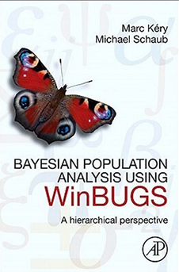

<p float="center">
  
</p>


```
├── scripts.jl 
│     ├── chapter_7_3.jl       <- CJS with constant parameters
│     ├── chapter_7_4_1.jl     <- CJS with time-variation as fixed effect
│     ├── chapter_13_3.jl      <- Single-season occupancy with constant parameters
│     ├── chapter_13_4.jl      <- Single-season occupancy, heterogenous parameters explained by covariates
│     └── chapter_13_5.jl      <- Dynamic multi-season occupancy with constant parameters
└── Rcode
      └── bpa-code.txt          <- for reference. Massive file with all Rcode used in the book

```

#### Chapter 7 - Estimation of Survival from Capture-Recapture Data Using the CJS Model
- [x] 7.3 Models with constant parameters      - ```chapter_7_3.jl```
- [x] 7.4.1 Models with Time-Variation - fixed - ```chapter_7_4_1.jl```
- [ ] 7.4.2 Models with Time-Variation - ranef - ```chapter_7_4_2.jl```
- [ ] 7.4 Models with Individual-Variation


#### Chapter 13 - Estimation of Occupancy and Species Distributions from det/non-detect data in metapop designs using site occupancy models

- [x] 13.3 Single-season Occupancy  - ```chapter_13_3.jl```
- [x] 13.4 Single-season Occupancy with covariates - ```chapter_13_4.jl```
- [ ] 13.5 Dynamic multi-season occupancy - ```chapter_13_5.jl```


